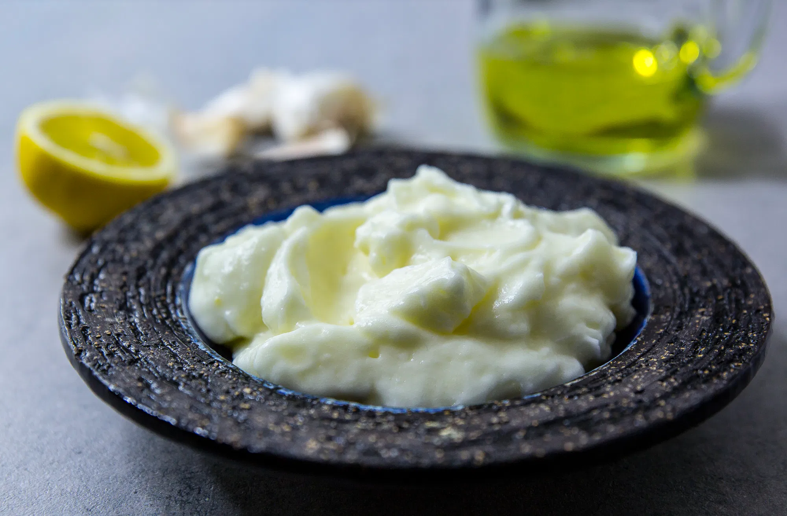

# Hummus

* Tre msk tahini
* Fyra vitlöksklyftor
* 1 msk citron
* 3 dl kikärtor
* Salt
* Spiskummin (Mycket)

# Toum

## Mixa

* 3 vitlöksklyftor

## Mixa följande till vitt skum

* 2 äggvitor
* 1 tsk salt
* 2 tsk citronsaft

## Droppa i tills klart

* 2,5 dl rapsolja

# Bakad potatis - röror

## Tonfisk

* 1 rödlök
* 2 burkar tonfisk
* 1 msk kapris
* 3 stjälkar selleri
* 1 msk senap
* 2 msk majonnäs
* 3 dl turkisk yoghurt
* Salt
* Peppar

## Kyckling

### Stek kyckling 
* 700 g kycklinglårfilé
* stekolja
* 2 msk curry
* 1 tsk ingefära
* 2 tsk gurkmeja
* 2 tsk örtsalt

### Blanda med
* 1 rödlök
* 100 g lättmajonös
* 3 dl turkisk yoghurt
* 1 röd paprika
* 1 gul paprika
* salt
* peppar
