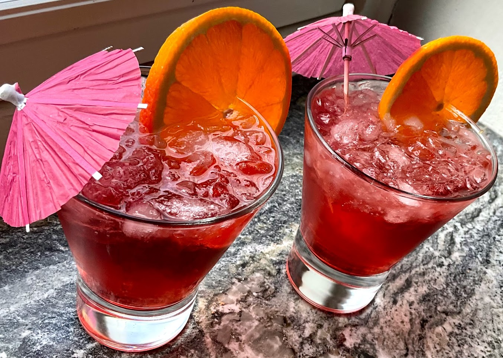
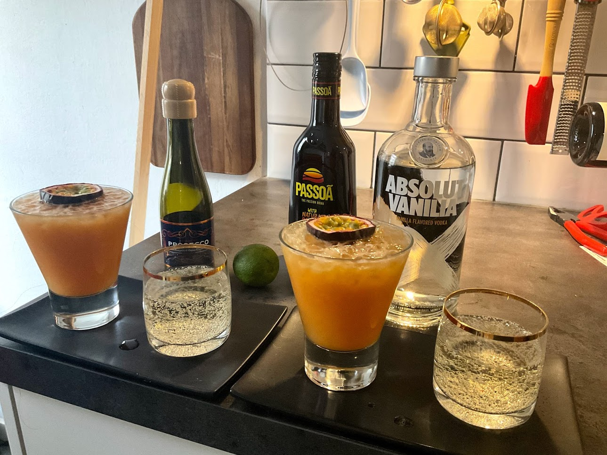

# Aperol Spritz

* 6 dl mousserande vin, torrt, gärna Prosecco
* 4 dl Aperol
* 2 dl sodavatten
* Iskuber
* Apelsin(er), skivad

Fyll sex glas med iskuber och fördela mousserande vin, Aperol och sodavatten i glasen. 

Tillsätt skivad apelsin, servera! 

# Moscow Mule

* 4 cl Vodka
* 2 cl Limejuice
* 15 cl Ginger Beer

* Häll vodka och limejuice i ett glas eller kopparmugg.
* Fyll glaset till hälften med krossad is.
* Tillsätt ginger beer (inte att förväxla med ginger ale) och rör om varsamt.
* Fyll upp resten av glaset med is.
* Garnera med ett limehjul och en kvist mynta.

# Negroni

* Några isbitar
* 1 dl sodavatten (eventuellt)
* 2 cl Gin
* 2 cl Martini Rosso
* 2 cl Campari Bitter

# Pornstar Martini

* 5 cl vaniljvodka
* 2 cl Passionsfruktslikör
* 2 cl lime juice
* 3 cl sockerlag
* 1,5 passionsfrukt (1 till drinken och 0.5 som garnityr)

## Serveras med
* 4 cl mousserande
