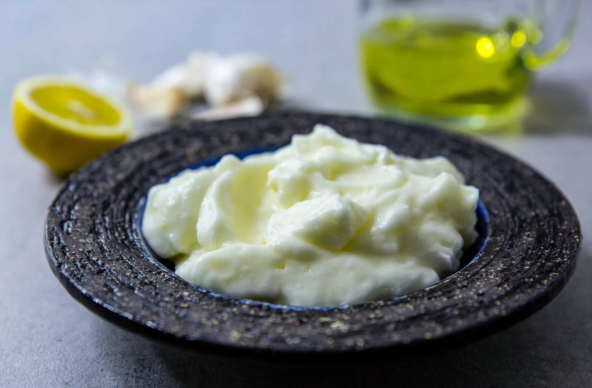

# Mått/vikt byttor

| Namn               |   Vikt | Volym |
|:-------------------|-------:|------:|
| Röd gryta          | 2464 g |       |
| Stor pastakastrull | 1048 g |       |
| Stor glasform      | 1820 g |       |
| Röd ugnsform       | 1560 g |       |
| Liten glasform     |  417 g |       |
| Stor rostfri bunke |        | 3,5 l |

# Chokladfondant

* 1 msk vetemjöl
* 1,5 msk socker
* 1 ägg + 1 gula
* 75 g choklad
* 50 g smör

Pensla formar med smält smör och pudra med socker.

Grädda i ugn 225 grader.

7 min liten form

9 1/2 min stor form

# Hummus

* tre msk tahini
* fyra vitlöksklyftor
* 1 msk citron
* 3 dl kikärtor
* Salt
* Spiskummin (Mycket)

# Pad Thai

## Stek upp
* En morot
* En lök
* Halvt paket risnudlar 
* Halv burk böngroddar
* 200g tofu

## Marinad 
* En pressad lime
* En vitlöksklyfta
* En msk farinsocker
* En msk japansk soya
* En msk vatten
* Koriander

## Garnering
* Limeklyftor
* Och jordnötter då
* Koriander

# Pannkakor (nyttiga)

## Blötlägg

* 2 msk chiafrön blötläggs i 1 dl vatten

## Mixa sen i matberedare tillsammans med

* 2 dl havregryn mals i matberedare
* 2 tsk bakpulver
* kanel
* 300g banan

# Toum

## Mixa

* 3 vitlöksklyftor

## Mixa följande till vitt skum

* 2 äggvitor
* 1 tsk salt
* 2 tsk citronsaft

## Droppa i tills klart

* 2,5 dl rapsolja

# Kryddor

* Basilika - Normal
* Cayenne - TGR
* Chili flakes - Normal, TGR
* Citronpeppar - Normal
* Curry - Normal, TGR
* Dill - Normal
* Dragon - Normal, TGR
* Fänkål - Normal
* Gräslök - TGR
* Gurkmeja (Tumeric) - Normal, TGR
* Herbes de provence - Normal
* Himalaya salt - Normal, TGR
* Italian spice mix - Normal
* Kanel - Normal, TGR
* Kanelstång - TGR
* Kardemumma - TGR
* Koriander - TGR
* Kryddnejlika (Hel) - TGR
* Kummin - Normal
* Lagerblad - Normal
* Lakritskrydda - Normal
* Mald ingefära - TGR
* Marokansk kryddmix - TGR
* Mexico mix / Mexican - Normal
* Muskotnöt - TGR
* Oregano - Normal
* Paprika - Normal
* Paprika (smoked) - Normal
* Persilja - Normal
* Rose peppar - TGR
* Rosenpaprika - TGR
* Spiskummin - TGR
* Tandori - Normal, TGR
* Vanilj - Normal
* Vitpeppar - TGR

